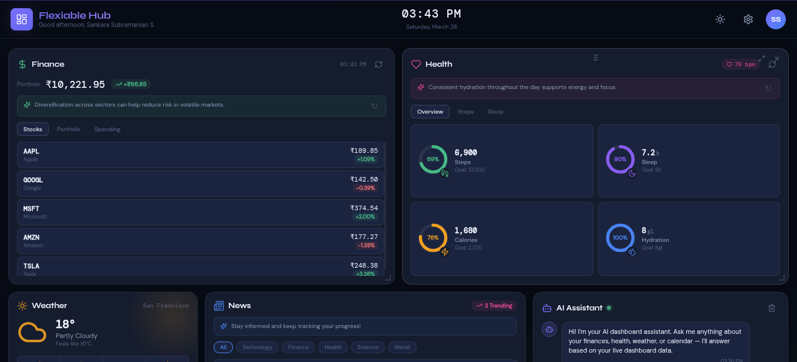
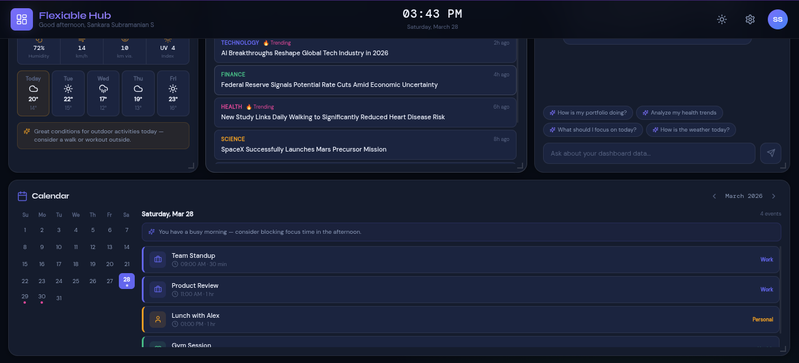

# Flexiable Dashboard — AI-Powered Multi-Domain Dashboard

A modern, extensible dashboard with drag-and-drop widgets, persistent layouts, live data simulation, and AI-generated insights across multiple life domains — powered by OpenRouter + Claude.




---

## Quick Start

### Prerequisites
- Node.js 18+
- npm or yarn

### Installation

```bash
git clone https://github.com/sankara2003/Flexiable_Dashboard.git
cd Flexiable_Dashboard-dashboard
npm install
npm start
```

The app runs at **http://localhost:3000**

### Build for Production

```bash
npm run build
```

---

## Architecture Decisions

### Tech Stack
| Layer | Choice | Reason |
|---|---|---|
| Framework | React 18 | Component model, hooks ecosystem |
| Grid System | `react-grid-layout` | Battle-tested drag-and-drop grid with responsive breakpoints |
| Charts | Recharts | Declarative, React-native charting with good performance |
| Icons | Lucide React | Consistent, lightweight icon set |
| Styling | Pure CSS with CSS variables | Zero dependency, fast, full control over theming |
| State / Persistence | Zustand + `persist` middleware | Lightweight global state with automatic localStorage sync |
| AI | OpenRouter API (`anthropic/claude-sonnet-4-5`) | Real AI insights routed via OpenRouter with live dashboard data as context |

### Component Structure

```
src/
├── components/
│   ├── layout/
│   │   ├── Header.jsx          # Topbar with clock, settings, theme toggle
│   │   └── WidgetWrapper.jsx   # Drag handle, maximize, remove controls
│   └── widgets/
│       ├── FinanceWidget.jsx   # Stocks, portfolio chart, spending analysis
│       ├── HealthWidget.jsx    # Steps, sleep, calories, hydration rings
│       ├── WeatherWidget.jsx   # Current conditions, forecast strip
│       ├── NewsWidget.jsx      # Article feed with category filtering
│       ├── ChatWidget.jsx      # Full AI chat with conversation history
│       └── CalendarWidget.jsx  # Mini calendar + events panel
├── data/
│   └── mockData.js             # Realistic mock data generators
├── store/
│   └── layoutStore.js          # Zustand store with localStorage persistence
├── utils/
│   └── aiInsights.js           # OpenRouter API integration for insights + chat
└── styles/
    └── main.css                # Full design system, dark/light themes
```

### State Management

Layout and widget state are managed globally via **Zustand** with the `persist` middleware, which automatically serialises state to `localStorage` under the key `"Flexiable_Dashboard-dashboard"` and rehydrates it on every page load.

The store (`useDashboardStore`) exposes:

| Action | Description |
|---|---|
| `setLayouts(allLayouts)` | Called by `react-grid-layout` on every drag / resize |
| `toggleWidget(id)` | Toggle a widget's visibility from the settings panel |
| `removeWidget(id)` | Hide a widget from its own × button |
| `resetLayout()` | Wipe stored state back to `defaultLayouts` / `defaultWidgets` |
| `toggleDarkMode()` | Flip between dark and light theme |

Only `layouts`, `widgets`, and `darkMode` are persisted via `partialize` — any transient runtime state added later won't accidentally leak into storage.

### Persistence

- Widget positions and sizes are serialised as `react-grid-layout` layout objects and saved on every drag/resize via `setLayouts`.
- Widget visibility (show/hide) is stored per widget ID in the `widgets` slice.
- On app load, Zustand's `persist` middleware rehydrates all stored state automatically; missing keys fall back to `defaultLayouts` and `defaultWidgets`.

---

## AI Insights Implementation

### Architecture
```
Widget → generateInsight(domain, data) → OpenRouter API (claude-sonnet-4-5) → Inline insight card
         loadAllInsights()             → all 4 domains in parallel on app load
         chatWithAI(messages)          → ChatWidget multi-turn conversation
```

AI insights are powered by the **OpenRouter API** using the `anthropic/claude-sonnet-4-5` model via the `https://openrouter.ai/api/v1/chat/completions` endpoint (OpenAI-compatible format).

### Data-Grounded Responses

Every API call passes the **actual live mock data** as context — the AI never invents numbers or draws on external knowledge. The system prompt explicitly includes:

- **Finance**: real-time stock prices, week-over-week spending by category, portfolio value start → end over 31 days
- **Health**: exact step count vs goal, sleep hours vs goal, calories, heart rate, hydration
- **Weather**: full current conditions + 5-day forecast
- **Calendar**: all events with titles, times, durations, and dates

Example system prompt sent to the model:

```
━━━ FINANCE ━━━
Stocks: [{"symbol":"AAPL","price":190.4,"change":1.4}, ...]
Spending (this week vs last): [{"category":"Food","thisWeek":130,"lastWeek":168}, ...]
Portfolio: started $10047.65 → now $10708.12 over 31 days

━━━ HEALTH ━━━
Steps: 5268/10000 | Sleep: 7.1h/8h | Calories: 1549/2200 | Heart rate: 66 bpm | Hydration: 8/8

RULES:
- Only answer based on the data above.
- Never fabricate numbers or trends.
- If asked about something not in the data, say "That data isn't available on your dashboard."
```

### Prompting Strategy

Each domain has a strict, data-bound prompt template in `buildPrompt(domain, data)`:

- **Finance**: Injects stock symbols + prices, category spending deltas, portfolio start/end values. Instructs the model to reference actual numbers only.
- **Health**: Injects each metric with its goal. Instructs the model to identify the most notable gap or achievement by comparing value vs goal.
- **Weather**: Injects full condition + forecast JSON. Requests one practical planning tip based strictly on the provided values.
- **Calendar**: Injects all events with times. Requests one scheduling observation based only on the listed events.

A shared `STRICT_SYSTEM_PROMPT` is applied to all `generateInsight` calls, enforcing data-only responses at the system level as a second layer of constraint.

### Auto-Loading on App Init

`loadAllInsights()` fires all four domain insight requests in **parallel** via `Promise.allSettled` on app mount, so all widgets populate simultaneously without blocking each other.

```js
// In your top-level component or context provider
const [insights, setInsights] = useState({});

useEffect(() => {
  loadAllInsights().then(setInsights);
}, []);
```

### AI Chat Widget

The `ChatWidget` maintains full conversation history and sends all prior turns to the model on each message, enabling contextual multi-turn conversation. The system prompt is built fresh on every send via `buildChatSystemPrompt()`, which snapshots the current dashboard data at call time — so the AI always reasons from the latest values.

### Fallback Strategy

If any API call fails (no connection, rate limit, etc.), `getFallbackInsight(domain, data)` returns a pre-written insight that still references real values from the data passed in. The UI is never left blank.

---

## Live Data Simulation

Each widget refreshes its mock data on an interval using `setInterval`:

| Widget | Update Frequency | Mechanism |
|---|---|---|
| Finance | Every 8s | Stock prices drift ±1%, portfolio recalculates |
| Health | Every 10s | Step/calorie/hydration values fluctuate realistically |
| Weather | Static | Weather changes slowly; mock is sufficient |
| News | Static | News feed; would use a real API in production |
| Calendar | Static | Deterministic from today's date |

Updates use React's `useState` + `useCallback` + `useEffect` to avoid stale closures and unnecessary re-renders.

---

## Design System

- **Font**: Syne (display/headers) + DM Sans (body) + DM Mono (numbers/code)
- **Theme**: Dark by default; one-click toggle to light. Full CSS variable system.
- **Color coding**: Each domain has its own accent color (Finance = emerald, Health = rose, Weather = amber, News = blue, Chat = violet, Calendar = indigo)
- **Responsive**: 5 breakpoints (xxs → lg) via `react-grid-layout` Responsive + WidthProvider

---

## Assumptions & Tradeoffs

| Decision | Tradeoff |
|---|---|
| Mock data only (no real APIs) | Keeps setup frictionless; real APIs (Alpha Vantage, OpenWeatherMap, NewsAPI) would be straightforward to add |
| OpenRouter API called client-side | Simple for prototyping; production would proxy through a backend to protect the API key |
| AI grounded strictly in mock data | Responses are consistent and testable; switching to real APIs would make insights truly live |
| No user accounts | Layout persistence is per-browser via Zustand + localStorage; a backend would enable cross-device sync |
| CSS-only (no Tailwind) | Full control and no build step complexity, but more verbose |
| Single bundle | Simpler to deploy; code-splitting per widget would improve TTI for large dashboards |

---

## Deployment

### Vercel
```bash
npm install -g vercel
vercel
```

---

## License

MIT